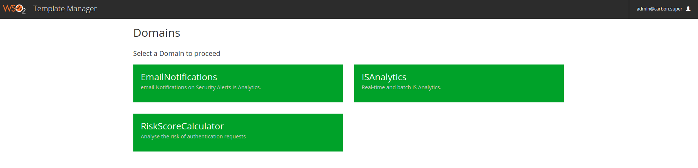

# Configure Risk Based Adaptive Authentication

## Configuring WSO2 IS
>This feature is supported by WSO2 Identity Server 5.5.0

### Setting up

Follow the steps to enable Risk Based Adaptive Authentication Feature in WSO2 IS.

1. Copy org.wso2.carbon.identity.authenticator.risk-1.0.0-SNAPSHOT.jar into 
`<IS_HOME>/repository/components/dropins/` directory
2. Add following configuration information in `identity.xml` file at `<IS_HOME>/repository/conf/identity/` directory
    ```xml
     <Analytics>
        <Enabled>true</Enabled>
        <DASServerURL>https://localhost:9444</DASServerURL>
    </Analytics>
    ```
   * `<Enabled>true</Enabled>` enables Risk Based Adaptive Authentication. If you want to disable the feature make it 
  `false`
   * `<DASServerURL>https://localhost:9444</DASServerURL>` is the URL for the WSO2 IS Analytics Server
3. [Start](https://docs.wso2.com/display/IS550/Running+the+Product) the Identity Server with the command `sh wso2server.sh -DenableConditionalAuthenticationFeature`

### Running the Feature

1. Configure a Service Provide with Multi-factor authentication steps. Follow the steps given [here.](https://docs.wso2.com/pages/viewpage.action?pageId=85384955)
2. Now you can add a script to JavaScript based Conditional Steps in `Advanced Configuration` under Local & Outbound 
Authentication Configuration.

3. Add the following script and click `Enable Script`.
    ```javascript
    function(context) {
       executeStep({
           id: '1',
           on: {
               success: function (context) {
    
                 // getRiskScore(context,properties) requires a key-value pair map as the second argument. 
                 // Since no properites are required, keep the map empty
                 var properties = {};
                 // properties.property1 = "test1";
                 // properties.property2 = "test2";
                 
                 var riskscore = getRiskScore(context , properties);
                 if (riskscore == 0) {
                    Log.info("No risk in the authentication request from user " + context.subject.authenticatedSubjectIdentifier);
                             Log.info(context.subject.authenticatedSubjectIdentifier);
                 }
                 else{
                    Log.info("High Risk authentication request from the user {"+
                             "Username : "+ context.subject.authenticatedSubjectIdentifier + ", " +
                             "UserStoreDomain : " +context.subject.userStoreDomain + ", " +
                             "TenantDomain : " +context.subject.tenantDomain + "}");
                    executeStep({id: '2'});
                    executeStep({id: '3'});
                }
               }  
           }
       });
    }
    ```
   * `getRiskScore(context, properties)` is the function to evaluate the risk of the authentication request. 
   This function requires two mandatory arguments. 
        * context - the authentication context
        * properties - a key value pair map containing the additional properties. (The current risk calculation rules
         do not require any additional properties. Therefore send an empty map.)
   * After the successful authentication of first step, authentication flow is decided by the risk score. (You may 
   change the behaviour of the flow.)
   
## Configuring WSO2 IS Analytics

Follow the steps to configure WSO2 IS Analytics to analyze the risk of authentication requests

### Setting up
1. Configure IS Analytics for Geolocation Statics. Steps are given in this [documentation.](https://docs.wso2
.com/display/IS550/Using+Geolocation+Based+Statistics)
2. Copy the domain template `risk-calculator-rules.xml` file to 
`<IS_ANALYTICS_HOME>/repository/conf/template-manager/domain-template/` directory.
3. Copy `risk-calculator-config.xml` file to `<IS_ANALYTICS_HOME>/repository/conf/` directory.
4. Start the IS Analytics server and login
5. Install Risk Calculator Carbon App `risk_calculator.car` in the server.
6. Copy the `api#authentication#adaptive#risk.war` file to 
`<IS_ANALYTICS_HOME>/repository/deployment/server/webapps/` directory.

### Running the feature

 Configure the rules that you want to consider for risk analysis. IS Analytics supports three rules. You can add none
  or many from each rule.
2. Click on `Template Manager` under the Dashboard section in Management Console. It will direct you the Template 
Manager UI.
3. Now you can see the available domains. Click on `RiskScoreCalculator`.

4. In the next UI, click on `Create New Scenario` button to add a new rule. 
5. Select the required rule in the drop down menu in the `Senario Type` section. 
6. Provide necessary information and click `Add Scenario` to save the rule.

#### Location Based Risk Rule

This rule decides the risk of an authentication request based on the login location of the user. If the login 
location is not one of the usual place that the user normally logs in, the authentication request is considered to 
be at risk. 
 


* Give a name for your rule in `Scenario Name` field.
> Name can not be empty or contain white spaces.
* Give a suitable description for the rule.
* Define the number of days within which the user must have logged in from the same region as current.
> Number of days should be an integer

#### Time Based Risk Rule

This rule decides the risk of an authentication request based on the time during which the user logs in. A time
 of the day is defined during which authentication requests are accepted without a risk. If a user is logging 
 in outside the allowed time, the request is considered to be at risk.
 
 

 
 * Give a name for your rule in `Scenario Name` field.
 > Name can not be empty or contain white spaces.
 * Give a suitable description for the rule.
 * Select a time from the first drop down menu to start the allowed time range.
 * Select an end time from second drop down menu.
 > Times are given in 24 hours.
 
#### IP Based Risk Rule

This rules decides the risk of an authentication request based on the IP address. An allowed range of IP addresses 
are defined. If the authentication request is coming from an IP address which is not in the allowed ranged, that 
request is considered to be at risk.


 * Give a name for your rule in `Scenario Name` field.
 > Name can not be empty or contain white spaces.
 * Give a suitable description for the rule.
 * Define an IP address to start the allowed IP range.
 * Define an IP address to end the allowed IP range
 > Give the IP address in IPv4 format. 
 > *Example: 174.16.254.1*